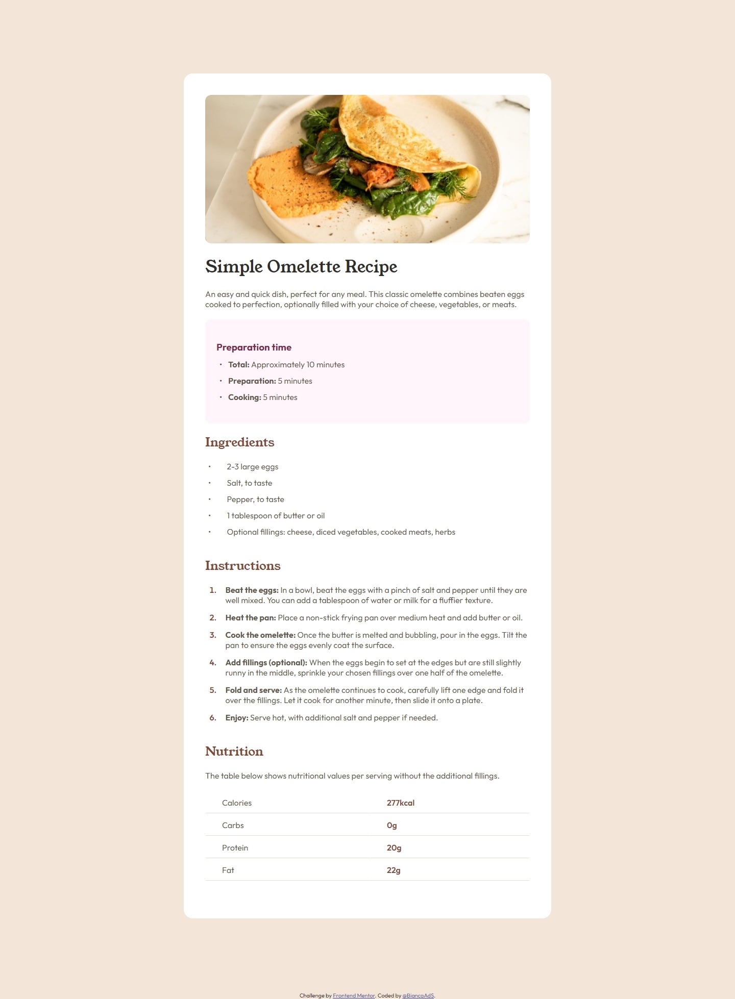
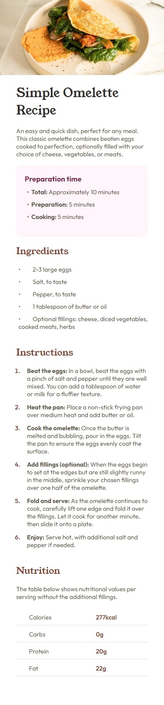

# Frontend Mentor - Recipe page solution

This is a solution to the [Recipe page challenge on Frontend Mentor](https://www.frontendmentor.io/challenges/recipe-page-KiTsR8QQKm/hub).

## Table of contents

- [Frontend Mentor - Recipe page solution](#frontend-mentor---recipe-page-solution)
  - [Table of contents](#table-of-contents)
  - [Overview :rocket:](#overview-rocket)
    - [Screenshot :camera:](#screenshot-camera)
    - [Links](#links)
  - [My process](#my-process)
    - [Built with](#built-with)
  - [Author](#author)

## Overview :rocket:

### Screenshot :camera:

**For Desktop** :computer:

**For Mobile** :iphone:

### Links

- Solution URL: [Solution URL](https://github.com/BiancaAdS/recipe-page)
- Live Site URL: [Live site URL](https://recipe-page-tau-inky.vercel.app/)

## My process

### Built with

- HTML
- CSS

## Author

- GitHub - [@BiancaAdS](https://github.com/BiancaAdS)
- Frontend Mentor - [@BiancaAdS](https://www.frontendmentor.io/profile/BiancaAdS)
